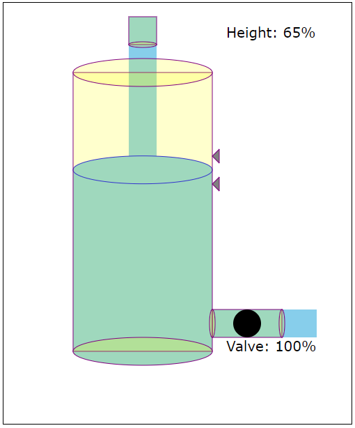

# water-tank

----
## what is water-tank module?

This module provides a model and view layers of a water tank. This module is developed for students to use as a plant to accomplish the OPC UA assignment in Factory Information Systems course. It is important to mention that the model is not accurately representing the water level in the tank but it is enough for the purpose of the assignment.

----
## How to use it?

install the module:

~~~~
$ npm install water-tank 
~~~~

use in the code:

~~~~
var Tank = require('water-tank')
var tank1 = new Tank(tankHeight, tankRadius, drainPipeRadius, inletFlow, highLevelSensor, lowLevelSensor, port);
~~~~

where, 
- tankHeight: the actual height of the tank
- tankRaduis: radius of the tank
- drainPipeRadius: raduis of the drain pipe
- inletFlow: inlet flowrate
- highLevelSensor: high level sensor location [% of the total height]
- lowLevelSensor: low level sensor location [% of the total height]
- port: the used oport to connect the view and the model
	
Example:

~~~~
var Tank = require('water-tank')
var tank1 = new Tank(10, 2.5, 1, 0.013, 0.7, 0.60, 3001);
tank1.on('HIGH_LEVEL',function(message){
	tank1.setValve(1);
})
tank1.on('LOW_LEVEL',function(message){
	tank1.setValve(0);
})
setTimeout(function(){
	tank1.startExperiment()
},3000);
~~~~

now visit http://localhost:3001/model

----
## Note:
1. The usage should be used on localally means that the webbrowser should be opend from in the same computer runs the module.
2. This module is not going to be supported further. 
3. This module is developed for course assignemnt which required using a specific configuration.

----